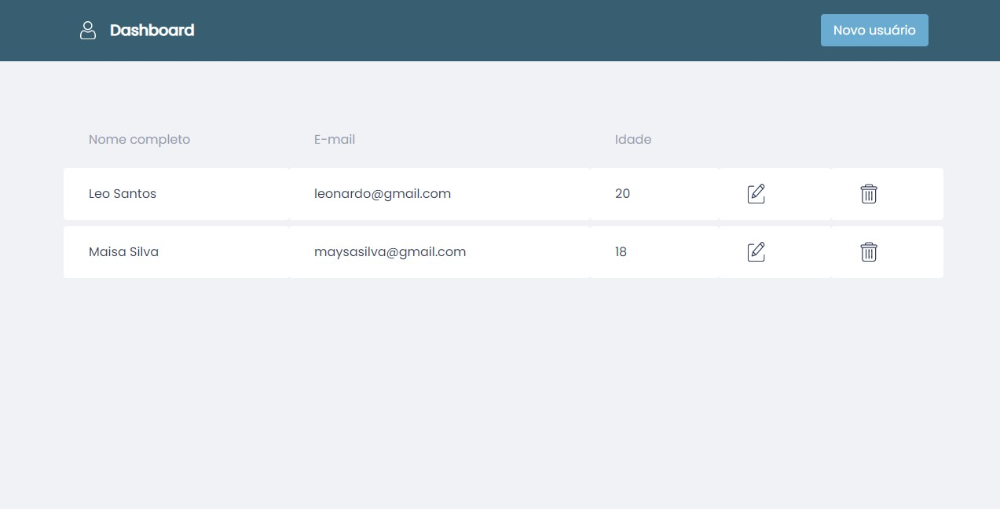
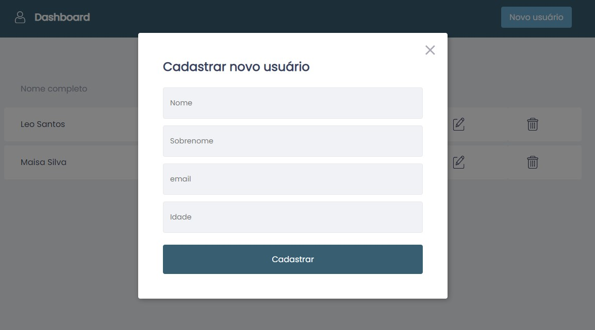
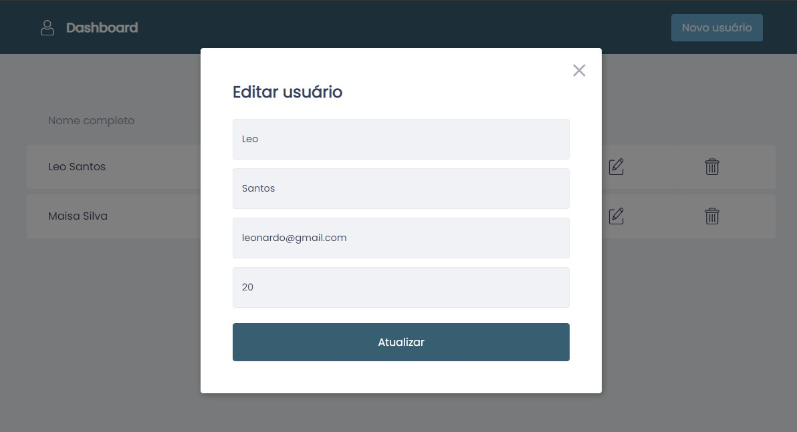
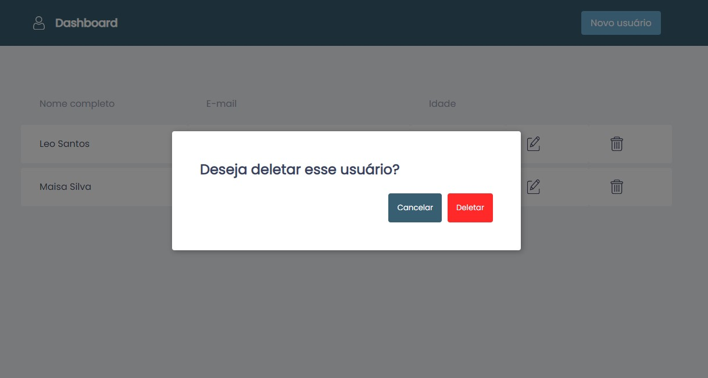

# CRUD para gerenciamento de usuários

Gerencie seus usuários de forma rápida e eficiente

### :art: Layout

Tela principal

Modal para criar usuário

Modal para editar usuário

Modal para deletar usuário

### :rocket: Tecnologias utilizadas

O projeto foi desenvolvido utilizando as seguintes tecnologias:

- [Styled Components](https://styled-components.com/)
- [Typecript](https://www.typescriptlang.org/)
- [React](https://pt-br.reactjs.org/)
- [HTML](https://developer.mozilla.org/pt-BR/docs/Web/HTML)
- [CSS](https://developer.mozilla.org/pt-BR/docs/Web/CSS)
- [Node](https://nodejs.org/en/)
- [TypeORM](https://typeorm.io/)
- [PostgreSQL](https://www.postgresql.org/)

### :memo: Licença

Este projeto está sob a licença MIT. Consulte [LICENÇA](https://github.com/leosantosx/api-do-github/blob/master/LICENSE) para obter detalhes.

